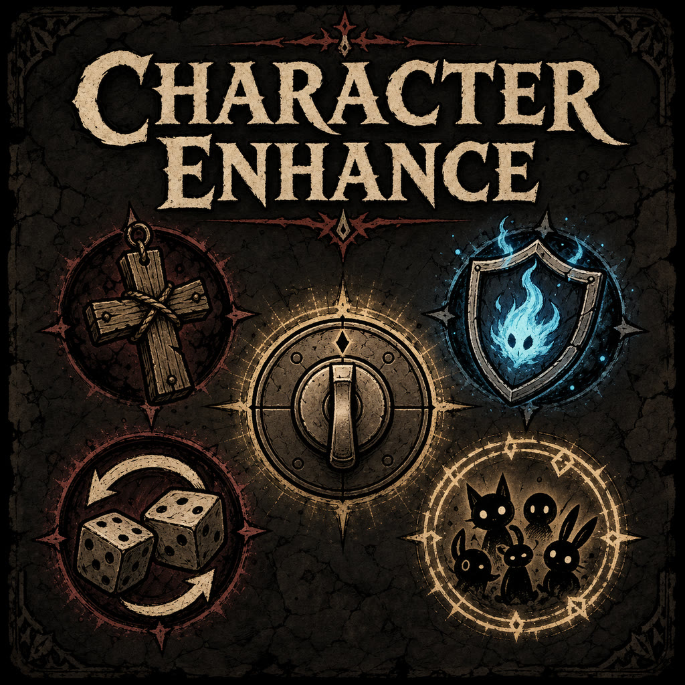

<p align="center">
  
</p>

<h1 align="center">Character Enhance</h1>

<p align="center">
  <strong>Independently configurable character enhancements for The Binding of Isaac: Repentance+.</strong>
</p>

<p align="center">
  <a href="README.md">English</a> |
  <a href="README.zh-CN.md">简体中文</a>
</p>

<p align="center">
  <a href="#eden">Eden</a> •
  <a href="#tainted-lost">Tainted Lost</a> •
  <a href="#tainted-blue-baby">Tainted Blue Baby</a> •
  <a href="#tainted-eden">Tainted Eden</a> •
  <a href="#bethany">Bethany</a> •
  <a href="#familiar-capacity">Familiar Limit Fix</a> •
  <a href="#small-player-pickup-range">Small Player Pickup Range Fix</a> •
  <a href="#clog-ground-damage">Clog Creep Damage Fix</a> •
  <a href="#held-item-protection">Pickup Animation Fix</a> •
  <a href="#kids-drawing-form-fix">Kid's Drawing Form Fix</a> •
  <a href="#ocular-rift-sound-fix">Ocular Rift Sound Fix</a> •
  <a href="#mod-config-menu">Mod Config Menu</a> •
  <a href="#installation">Installation</a>
</p>

---

## Requirements

- *The Binding of Isaac: Repentance+*, version `1.9.7.15`
- This mod is tested only on game version `1.9.7.15`; other versions are
  unverified.
- Standard Lua Mod API; REPENTOGON is not required
- [Mod Config Menu Impure](https://steamcommunity.com/sharedfiles/filedetails/?id=3701683951) is optional

<a id="eden"></a>
## Eden

- Eden's native random starting passive is removed without leaving its
  pickup-only health, consumables, or spawned pickups behind. In its place,
  three random collectible pedestals appear and only one can be taken.
- Each Eden's Blessing collected creates its own three-pedestal choice at the
  start of the next run instead of adding one collectible directly.
- Both choices draw from all available active, passive, and familiar
  collectibles except items tagged `noeden`. Already-owned collectibles are
  excluded, and separate choices in the same starting room do not repeat one
  another. Continuing a saved run does not create the choices again.

<a id="tainted-lost"></a>
## Tainted Lost

- Starts each new run with Wooden Cross (trinket ID 121). Continuing a saved
  run does not grant another copy.

<a id="tainted-blue-baby"></a>
## Tainted Blue Baby

- Devil Deals use Blue Baby's equivalent Soul Heart prices: items worth one or two
  Red Heart containers cost one or two Soul Hearts instead of always costing
  three. In multiplayer, the adjusted payment applies only to Tainted Blue Baby.
- At full poop capacity, both small and large poop pickups retain collision but
  are not collected, staying on the ground for later. Below capacity, they
  retain vanilla behavior.

<a id="tainted-eden"></a>
## Tainted Eden and full-inventory rerolls

- Full-inventory rerolls preserve each player's pre-reroll health composition,
  including heart containers, filled Red Hearts, Soul/Black Hearts, Bone
  Hearts, Rotten Hearts, Broken Hearts, Eternal Hearts, and Golden Hearts.
- An independent fix preserves the permanent stat gains already awarded by
  Void and Black Rune. Gains are tracked per player; stats supplied by the old
  passive inventory still reroll normally.
- Covers Tainted Eden penalty hits, D4, D100, matching D Infinity faces,
  D4/D100 invoked through Void or Metronome, Missing No., one-pip and six-pip
  Dice Rooms, the reversed Wheel of Fortune card, and comparable passive-item
  replacement.
- Voluntary damage such as Blood Donation Machines, Devil Beggars, Hell Games,
  IV Bag, Curse Room doors, and Sacrifice Room spikes retains vanilla behavior.
- An independent TMTRAINER slider controls whether TMTRAINER is included in
  each full-reroll Secret Room pool. `0%` always excludes it, `50%` includes it
  for half of rerolls on average, and `100%` preserves vanilla behavior. Normal
  pedestal pickups and rerolls started while TMTRAINER is owned are unrestricted.
  Rejected TMTRAINER results are replaced by a passive/familiar result before
  entering the inventory, so they cannot create extra glitched items, collide
  with an active-item slot, or change the rerolled item count.
- Items generated on Esau Jr.'s first use are registered once with vanilla
  transformation progress. Later body swaps do not replay first-pickup effects.

<a id="bethany"></a>
## Bethany

- Soul Heart gains provide double Soul Charge: a full Soul Heart grants 4 and a
  half Soul Heart grants 2. Pickups and direct item grants are both covered.
- Soul Charge absorbs penalty damage that would lower Devil/Angel Room chance,
  protecting both red health and deal chance. Half-heart damage costs 2 and
  full-heart damage costs 4; any positive charge can absorb one qualifying hit.
- Safe damage, including Devil Beggars, Hell Games, blood donation, Sacrifice
  Room spikes, and Curse Room entry/exit, removes red health normally and never
  consumes Soul Charge.
- Absorbed penalty damage still destroys Perfection and affects its progress;
  only red health and room-deal probability are protected.
- While Gello is active, Book of Virtues wisps keep orbiting their owning
  player instead of moving their orbit center to Gello. Wisp and Gello stats,
  count, and lifetime remain unchanged.
- Shield Effects offers a legacy translucent Soul Veil, a blue
  energy-pane Particle Wall, and a dense Frosted Soul shell, plus five
  bright-to-afterglow hit effects and three original Soul Shield sound sets.
  Each sound continuously blends custom thin, middle, and
  thick recordings; most visual and audio change occurs from 0–30 charge and
  then eases toward 99. Separate MCM previews test idle, hit, and 4/30/99-charge
  sound feedback without damage. Absorbed hits keep Bethany's pose and never
  play her hurt voice. Turning Shield Effects off fades the shield away with
  its selected disappearance sound.

<a id="familiar-capacity"></a>
## Familiar Limit Fix

- Preserves the vanilla 64-real-familiar hard limit without REPENTOGON.
- Blue Flies and Blue Spiders occupy real slots only up to a soft total of 60.
  Overflow is stored by player and type, then restored at most 2 every 3 frames
  when slots reopen.
- Permanent and quest familiars, wisps, Bone Spurs, and other important
  familiars are never deliberately banked. At the hard edge, an owned Blue Fly
  or Blue Spider is banked to reserve space for an important familiar.
- Overflow animation is coalesced and throttled. Banked counts survive
  continued games and remain stored while this module is disabled; a new run
  resets them.

<a id="small-player-pickup-range"></a>
## Small Player Pickup Range Fix

- In every non-combat room, size-down effects including Pluto retain their
  small appearance while the player's physical radius returns to its normal
  size for pickup and contact interactions. Active combat restores the smaller
  collision; pickup entities themselves are never resized.

<a id="clog-ground-damage"></a>
## The Clog Creep Damage Fix

- The Clog (entity 914.0.0) can take damage from player creep, including Free
  Lemonade. Damage, radius, and tick rate follow the creep's current values;
  other enemies remain unchanged.

<a id="held-item-protection"></a>
## Pickup Animation Fix

- Using R Key or Forget Me Now during a collectible's pickup animation finishes
  the pickup before the run or floor resets. This prevents the item from
  disappearing before it reaches the inventory. In multiplayer, each player's
  pending pickup is completed independently.

<a id="kids-drawing-form-fix"></a>
## Kid's Drawing Form Fix

- Mom's Box adds one Guppy transformation count to Kid's Drawing, for two
  counts with a normal copy and three with a golden copy. A golden Kid's
  Drawing with Mom's Box therefore triggers the Guppy transformation directly.

<a id="ocular-rift-sound-fix"></a>
## Ocular Rift Sound Fix

- While an Ocular Rift holder is not firing tears, passive tear-effect sources
  such as Finger! no longer replay Ocular Rift's shoot sound. Actual fired
  tears and the portal sound retain vanilla behavior.

<a id="mod-config-menu"></a>
## [Mod Config Menu Impure](https://steamcommunity.com/sharedfiles/filedetails/?id=3701683951)

The first option selects English (default) or Simplified Chinese. Only the
selected language is displayed, and the choice is saved independently from
gameplay settings.

All nineteen gameplay settings remain independently configurable:

1. Familiar Limit Fix
2. Small Player Pickup Range Fix
3. Clog Creep Damage Fix
4. Pickup Animation Fix
5. Kid's Drawing Form Fix
6. Ocular Rift Sound Fix
7. Eden Starting Passive Choice
8. Eden's Blessing Choice
9. Starting Wooden Cross
10. Blue Baby Deal Prices
11. Poop Queue Overflow Fix
12. Keep Health on Reroll
13. Keep Absorbed Stats
14. Esau Jr. Pickup Effects
15. TMTRAINER Reroll Chance
16. Double Soul Charges
17. Soul Charge Shield
18. Shield Effects
19. Gello Wisp Orbit Fix

Options are grouped under the tabs `General`, `Eden`, `T-Lost`, `T-Blue Baby`,
`T-Eden`, and `Bethany`. The integration supports both Mod Config Menu
Impure's global `MCM` API and legacy/localized editions exposing
`ModConfigMenu`. Without MCM, saved or default settings still work normally.

<a id="installation"></a>
## Installation

Copy the complete `character-enhance` folder into the game's `mods` directory,
then enable it from the in-game Mods menu.

Steam Deck/Linux:

```text
/home/deck/.local/share/Steam/steamapps/common/The Binding of Isaac Rebirth/mods/character-enhance
```

Windows:

```text
C:\Program Files (x86)\Steam\steamapps\common\The Binding of Isaac Rebirth\mods\character-enhance
```

In multiplayer, eligible effects and familiar banks are handled separately for
each player.
